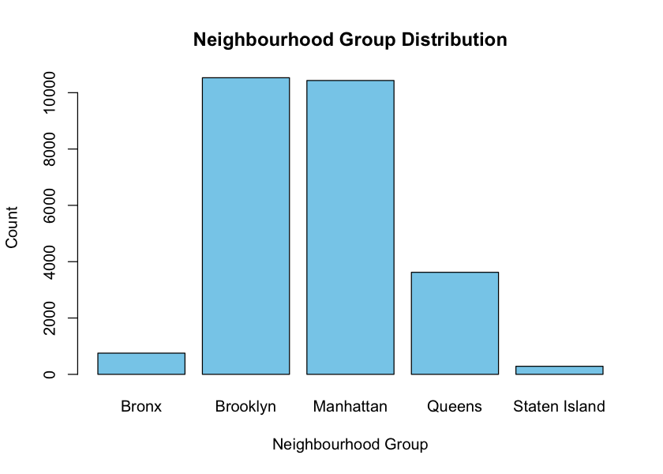
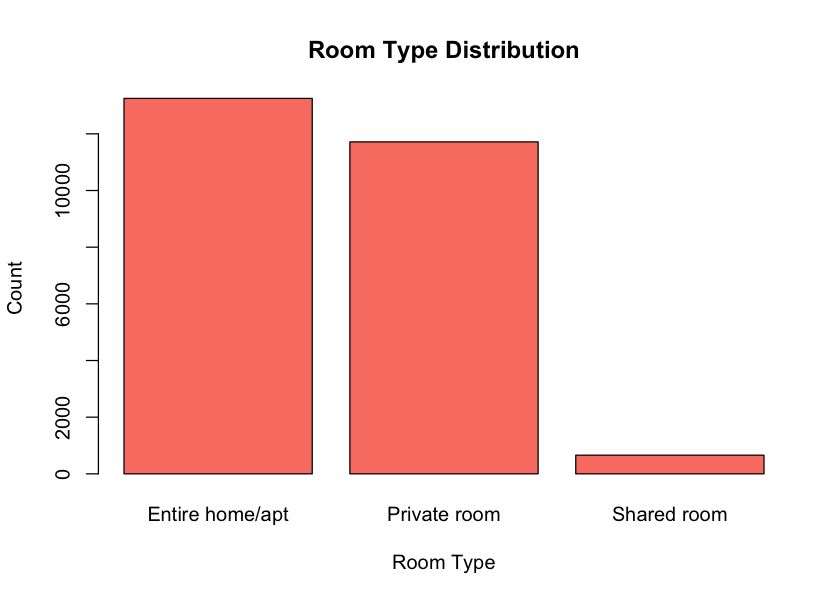
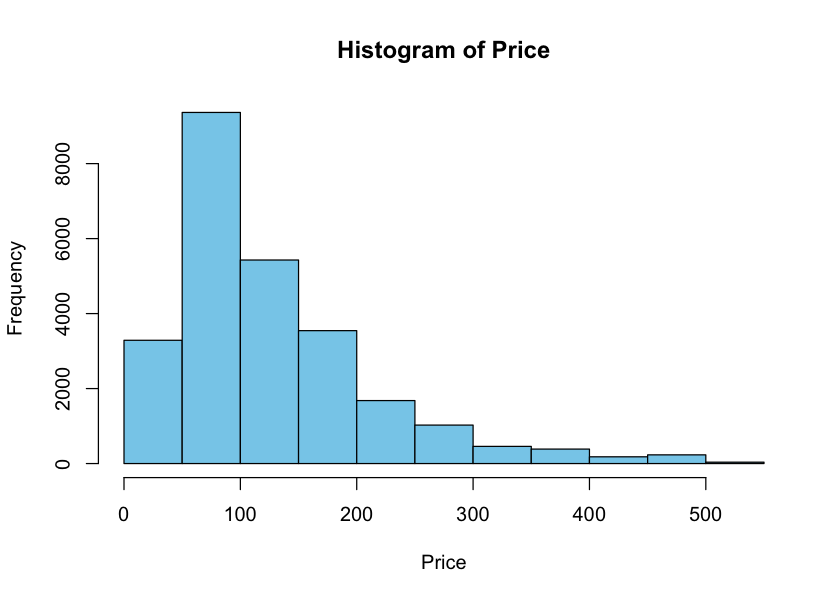
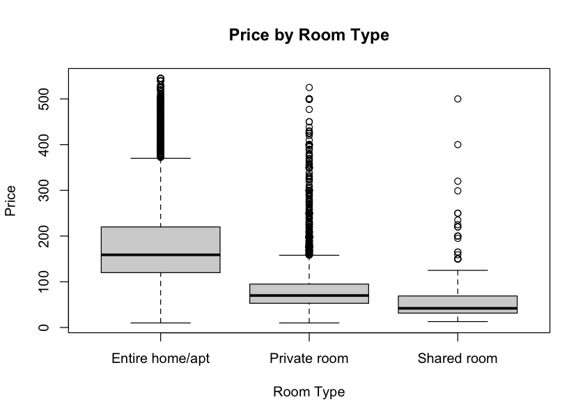

# 📊 NYC Airbnb Listings Analysis

This project analyzes the 2019 NYC Airbnb dataset to understand pricing trends, room type differences, neighborhood patterns, and statistical relationships.

---

## 🚀 Project Overview
- Cleaned and prepared Airbnb listings data  
- Explored distributions (price, room type, neighborhood)  
- Mapped listing locations  
- Conducted hypothesis testing and regression  
- Exported plots to the `/images` folder  

---

## 📁 Project Structure
```
airbnb_analysis.R        # Main analysis script
AB_NYC_2019.csv          # Dataset
images/                  # All generated plots
README.md                # Documentation
```

---

# 📊 Key Visuals

### 🏙️ Neighbourhood Distribution  
  
Path: `images/neighbourhood_distribution.png`

---

### 🏠 Room Type Distribution  
  
Path: `images/room_type_distribution.png`

---

### 💲 Price Distribution  
  
Path: `images/price_histogram.png`

---

### 🧪 Room Type ANOVA  
  
Path: `images/room_type_anova.png`

---

# 🧪 Statistical Highlights

### 1️⃣ Manhattan vs Brooklyn Prices  
Path: `images/manhattan_brooklyn_box.png`

### 2️⃣ Entire Home vs Private Room  
Path: `images/entire_vs_private_box.png`

### 3️⃣ Reviews vs Availability  
Path: `images/reviews_availability_scatter.png`

### 4️⃣ Reviews vs Price  
Path: `images/reviews_price_scatter.png`

### 5️⃣ Availability vs Price  
Path: `images/availability_price_scatter.png`

---

## 🔧 Technologies Used
- R  
- tidyverse, janitor  
- Base R graphics  

---

## 📌 How to Run
Clone repo:
```bash
git clone git@github.com:kumarkarthik23/NYC_Airbnb_Analysis.git
```

Run analysis:
```r
source("airbnb_analysis.R")
```

Plots will be stored under `/images`.

---

## 👤 Author
**Kumar Karthik Ankasandra Naveen**  
ALY6010 — Probability Theory & Intro Stats
